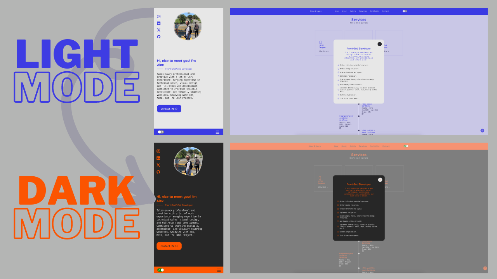

# Alex Grigore - React Portfolio

## Description
My motivation was to use my React and NPM skills to create a beautiful and detailed portfolio site.
This React-powered portfolio isn't just a showcase – it's my digital canvas where creativity meets innovation. Join me on a journey through sleek design, interactive elements, and a touch of my own personality.

## Table of Contents
- [Installation](#installation)
- [Usage](#usage)
- [License](#license)
- [Contributing](#contributing)
- [Tests](#tests)
- [Questions](#questions)

## Installation
No installation is required, to visit the site use the deployed link below.

## Usage
- Visit my live site.
- Toggle between light and dark themes – it's your call.
- Dive into my projects. Each one has a story, and I'd love to share it with you.
- Let's connect! Find me on LinkedIn or drop me a message via the contact form.
The following image shows my portfolio's appearance and functionality:

> **Note**: This layout is designed to be responsive and offers theme change.

The following link will take you to the deployed site <https://agworkgit.github.io/new-portfolio/>

## Tests
Does not require testing.

## Contributors
Alex Grigore

## Questions
For questions about the project, you can reach me at [GitHub: agworkgit](https://github.com/agworkgit) or contact me via email at agworksbox@gmail.com.

## License
This project is licensed under the MIT License.

## Badges

